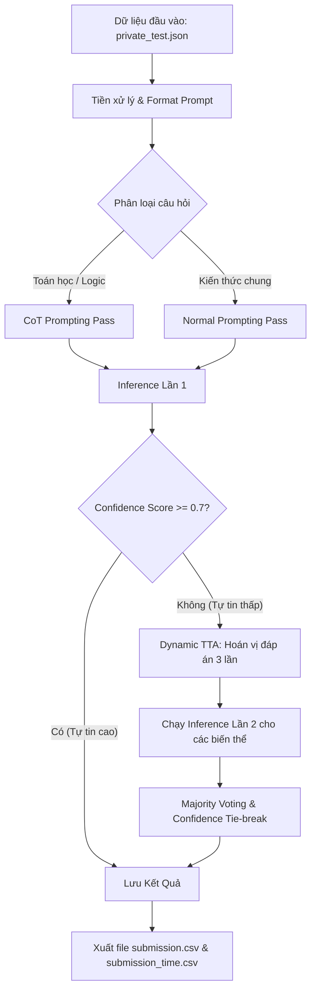

# 🚀 Hướng Dẫn Vận Hành Hệ Thống LLM Inference - Đội JAPAI

Dự án này là giải pháp của Đội **JAPAI** tham gia vòng 2 của bảng C trong cuộc thi Vietnamese Student HackAIthon. Giải pháp tập trung vào việc tối ưu hóa năng lực nội tại của mô hình ngôn ngữ lớn (LLM) thông qua kỹ thuật **Rule-based Routing**, **Chain-of-Thought (CoT)** và **Dynamic Test-Time Augmentation (TTA)**, đảm bảo cân bằng hoàn hảo giữa độ chính xác và thời gian suy luận.

---

## 1. Pipeline Flow (Luồng Xử Lý Hệ Thống)

Luồng xử lý được thiết kế động (Dynamic Inference) nhằm tiết kiệm tài nguyên tính toán đối với những câu hỏi dễ, và dành tài nguyên tối đa (sinh text CoT + TTA) cho những câu hỏi khó.

### Sơ đồ Kiến trúc Pipeline (Mermaid Diagram)

Chi tiết các bước:
Câu hỏi được đưa qua bộ Rule-based Router: Sử dụng Regex và tập từ khóa (Keywords) để phân loại xem đây là câu hỏi tính toán/suy luận hay kiến thức thông thường.

Inference (Lần 1): Chạy mô hình (sử dụng format CoT cho câu hỏi suy luận và Direct cho câu hỏi thường). Mô hình tính toán phân phối xác suất (Logits) hoặc sinh câu trả lời để dự đoán đáp án.

Đánh giá Độ tự tin (Confidence Assessment): Nếu chênh lệch xác suất giữa top 1 và top 2 đủ lớn (>= ngưỡng 0.7), chốt ngay đáp án để tiết kiệm thời gian.

Dynamic TTA (Lần 2): Những câu mô hình phân vân sẽ được xáo trộn vị trí các đáp án (Shuffle choices) và chạy lại 2-3 lần. Hệ thống sau đó dùng thuật toán Bầu chọn theo đa số (Majority Voting) để đưa ra đáp án cuối cùng.

2. Data Processing (Tiền Xử Lý Dữ Liệu)
Quá trình thu thập, làm sạch và xử lý dữ liệu được tự động hóa hoàn toàn trong lúc chạy:

Parse Dữ liệu: Đọc file /code/private_test.json.

Làm sạch & Chuẩn hóa: Trích xuất phần question và danh sách choices. Tự động gắn nhãn (A, B, C, D...) cho các lựa chọn.

Xử lý TTA (Test-Time Augmentation): Hàm get_shuffled_variants() sẽ xáo trộn vòng tròn vị trí các lựa chọn đầu vào, đi kèm một bộ từ điển mapping để ánh xạ ngược đáp án sinh ra (A, B, C, D mới) về nhãn ban đầu nhằm tránh thiên kiến (Bias) của LLM với các nhãn nhất định.

Post-Processing (Hậu xử lý): Phân tích chuỗi sinh ra bằng CoT. Thuật toán tìm kiếm cụm từ khóa ĐÁP ÁN hoặc truy xuất ký tự chữ cái cô lập cuối cùng trong văn bản sinh ra để tách chính xác đáp án cần chọn.

3. Resource Initialization (Khởi Tạo Tài Nguyên)
Tải Trọng số Mô hình: Hệ thống khởi tạo trực tiếp mô hình Qwen/Qwen3.5-4B từ Hugging Face ở chuẩn FP16 (Float16) nhằm tương thích hoàn toàn với GPU NVIDIA RTX 5060Ti (16GB VRAM) của Ban Tổ Chức. Mô hình được tải vào VRAM với cấu hình Attention tối ưu (attn_implementation="sdpa") và cấp phát bộ nhớ động (expandable_segments:True).

Vector Database & Indexing: > Lưu ý: Cấu trúc giải pháp của đội tập trung vào Zero-shot Reasoning & Dynamic TTA, tối đa hoá sức mạnh kiến thức nền nội tại của LLM thay vì sử dụng External Knowledge (RAG). Do đó, giải pháp này KHÔNG yêu cầu khởi tạo Vector Database hay tạo Embedding Indexing. Điều này giúp loại bỏ nguy cơ nhiễu thông tin (noise retrieval) và giúp tốc độ chạy của hệ thống tăng lên đáng kể, giảm rủi ro về giới hạn bộ nhớ (OOM).

4. Hướng Dẫn Vận Hành Dành Cho Ban Tổ Chức (BTC)
Các thông số phần cứng dự kiến: NVIDIA RTX 5060Ti (16GB VRAM). Cấu hình đã được đội tinh chỉnh (Batch size, Max tokens) để tuyệt đối không xảy ra Out Of Memory.

Bước 1: Build Docker Image
Mở terminal tại thư mục gốc của dự án (nơi chứa file Dockerfile):

Bash
docker build -t team_submission_image .
Bước 2: Run Container
⚠️ YÊU CẦU QUAN TRỌNG VỀ TÀI NGUYÊN: Vì hệ thống tận dụng tối đa khả năng xử lý song song và cấp phát bộ nhớ động của PyTorch/HuggingFace, kính mong BTC chạy container kèm cờ --ipc=host (hoặc --shm-size=8g) để cấp đủ Shared Memory, tránh hiện tượng treo (freeze) tiến trình.

Cú pháp lệnh thực thi chuẩn:

Bash
docker run --gpus all --ipc=host \
  -v /absolute/path/to/host/data_dir:/code \
  team_submission_image
Trong đó: * /absolute/path/to/host/data_dir là đường dẫn thư mục nằm trên máy thật của BTC.

Yêu cầu: Thư mục này phải chứa sẵn file dữ liệu đầu vào mang tên private_test.json.

Bước 3: Thu thập kết quả
Ngay sau khi quá trình log trên màn hình hiển thị hoàn tất (✅ HOÀN THÀNH. Đã lưu file CSV theo chuẩn BTC.), hệ thống sẽ tự động sinh ra 2 file tại chính thư mục /absolute/path/to/host/data_dir vừa mount:

submission.csv (Chứa ID câu hỏi và đáp án)

submission_time.csv (Chứa ID câu hỏi và thời gian thực thi của riêng câu hỏi đó, đã được chia trung bình song song).

Đội JAPAI xin chân thành cảm ơn Ban Tổ Chức!